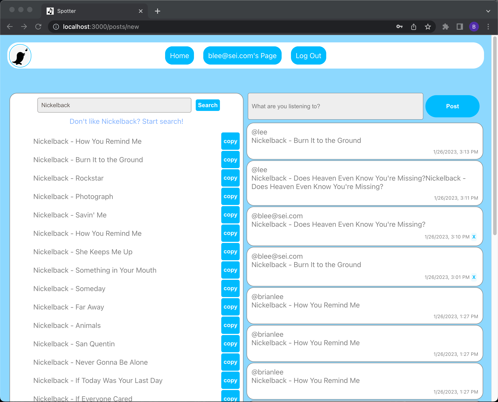
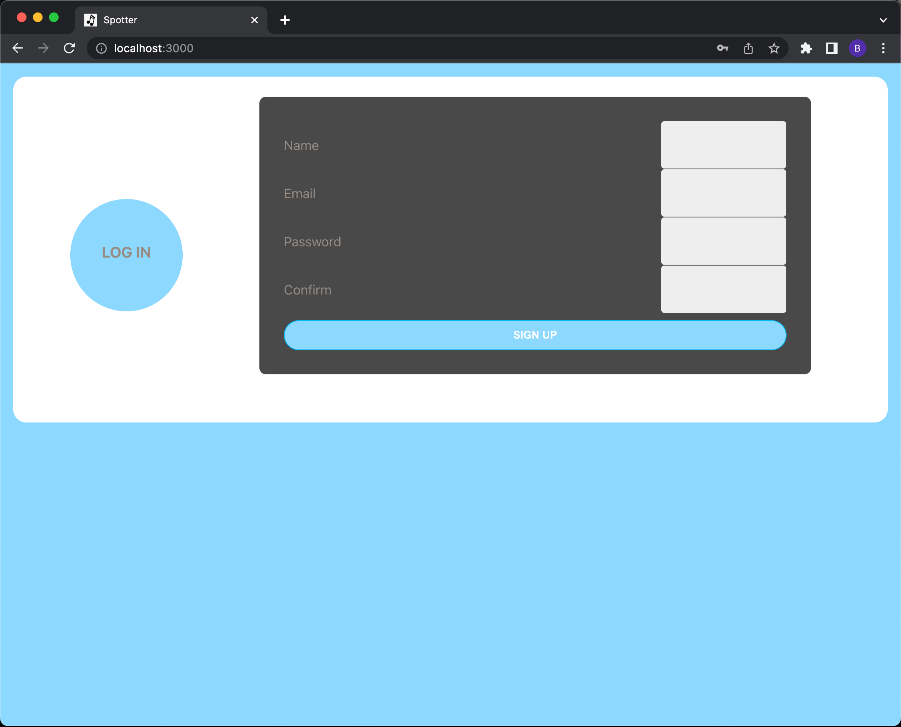
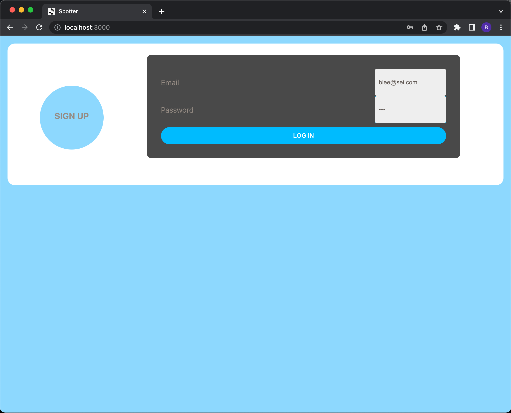

# Title: Spotter
Creator: Brian Lee

#### Check it out https://brians-spotter.herokuapp.com

## Patch v1 Notes

This is the initial launch of Spotter.

A microblogging service app that uses Deezer API to search through your favorite artist's discography.

## Background info:

This is a project I started for a Software Engineering bootcamp @GeneralAssembly.
Spotter is inspired by Twitter and Spotify.
In dedication to my search for new music, I hope you are able to explore and enjoy.

## Description:

### Theme: Twttter-esque

#### Home Page 

#### Signup Page

#### Login Page

## Pre-work

### Trello link:
https://trello.com/b/eB5kV7VS/react-spotter-ass4

### Initial ERD and Wireframe
https://lucid.app/lucidchart/d7ce2eec-9e48-4f5c-8ded-7263209c7404/edit?viewport_loc=217%2C-112%2C1381%2C1670%2C0_0&invitationId=inv_e67e1243-7030-4389-875b-40800beb23a1

## Icebox Summary (Details in Trello link above):
Next steps here are to:
1. Bring in album pictures
2. Connect the search function with the post input
3. Setup user page with user only posts
4. Add review functionality
5. Add favorites page?

## Technologies used:

React.js, MongoDB, Mongoose, Express.js, Node.js, Javascript, HTML, CSS, Deezer API, MongoDB Atlas, Heroku

## Credits:

Google Fonts
